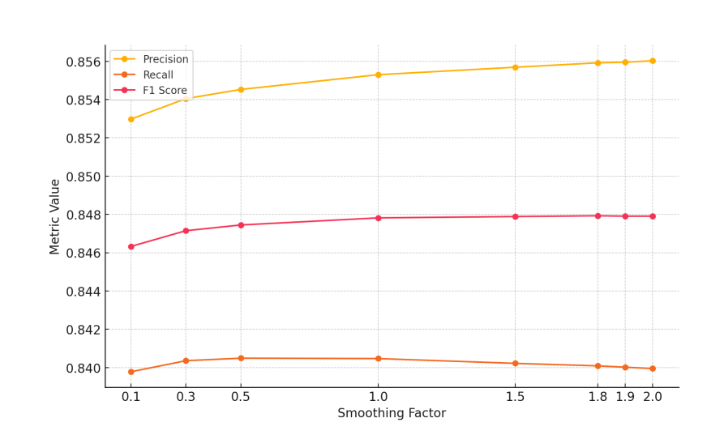
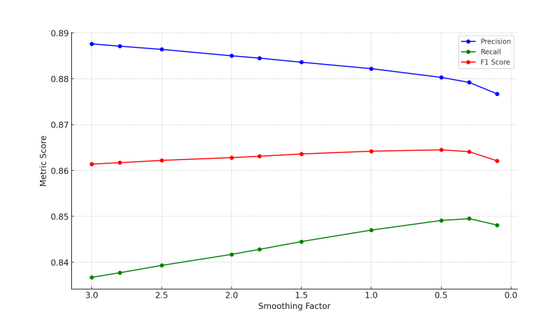
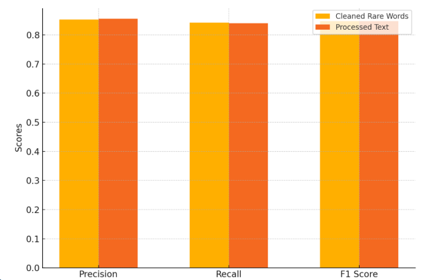
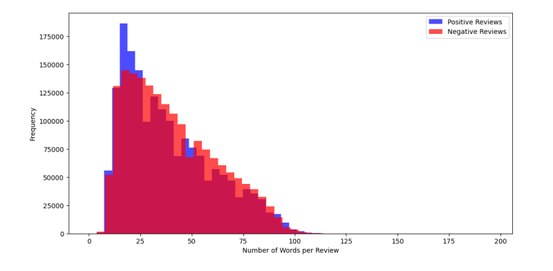

# Sentiment_Data_Analysis_Using_Multinomial_Naive_Bayes

## Overview

### Techniques Used
- **Bag-of-Words (BoW)** feature representation
- **Multinomial Naive Bayes**
- **Laplace smoothing** (tested across different smoothing factors)

### Experiments Included
1. **Processed Text + Naive Bayes** (smoothing factor comparison)
2. **Raw Text + Naive Bayes** (smoothing factor comparison)
3. **Removing Rare Words** (frequency threshold < 5 removed)
4. **Impact of Sentiment on Review Lengths** (distribution analysis)

---

## Experiments & Key Results

### Experiment 1 — Processed Text (BoW + Naive Bayes)
**Preprocessing applied:** tokenization + stopword removal.  
Smoothing factors evaluated: **0.1, 0.3, 0.5, 1.0, 1.5, 1.8, 1.9, 2.0**.

**Best result:** smoothing factor **1.8**  
- Precision **0.85592**
- Recall **0.84009**
- F1 **0.84793**

📌 Figure: Impact of smoothing factors on precision/recall/F1

---

### Experiment 2 — Raw Text (BoW + Naive Bayes)
**No preprocessing** (raw reviews).  
Smoothing factors evaluated: **0.1 → 3.0**.

**Best result:** smoothing factor **0.5**  
- Precision **0.88033**
- Recall **0.84914**
- F1 **0.86445**

📌 Figure: Smoothing factors vs precision/recall/F1 using raw text

---

### Experiment 3 — Removing Rare Words
Rare words appearing **< 5 times** are removed to reduce vocabulary size and noise.
- Rare words identified: **70,178**
- Metrics after retraining:
  - Precision **0.8534**
  - Recall **0.8425**
  - F1 **0.8479**

Comparison (Cleaned Rare Words vs Processed Text):
| Metric | Cleaned Rare Words | Processed Text |
|---|---:|---:|
| Precision | 0.8534 | 0.8553 |
| Recall | 0.8425 | 0.8405 |
| F1 Score | 0.8479 | 0.8478 |

📌 Figure: Cleaned rare words vs processed text

---

### Experiment 4 — Impact of Sentiment on Review Lengths
This experiment analyzes the relationship between **review length** and **sentiment label**.

**Observation:**
- Negative reviews are more concentrated around **shorter lengths**.
- Positive reviews show a slightly broader spread.
- There is **no clear length threshold** that cleanly separates positive vs negative, but **length may still help as a feature** in ambiguous cases.

📌 Figure: Histogram of review lengths by sentiment

---

## Summary of Findings (Experiments 1–4)
- **Raw text Naive Bayes** performed better than processed text in terms of **F1 score**, suggesting raw text retains helpful context.
- **Removing rare words** provides similar overall performance while reducing complexity and potentially improving efficiency.
- **Review length** alone is not a reliable sentiment indicator, but trends suggest it could be a useful auxiliary feature.

